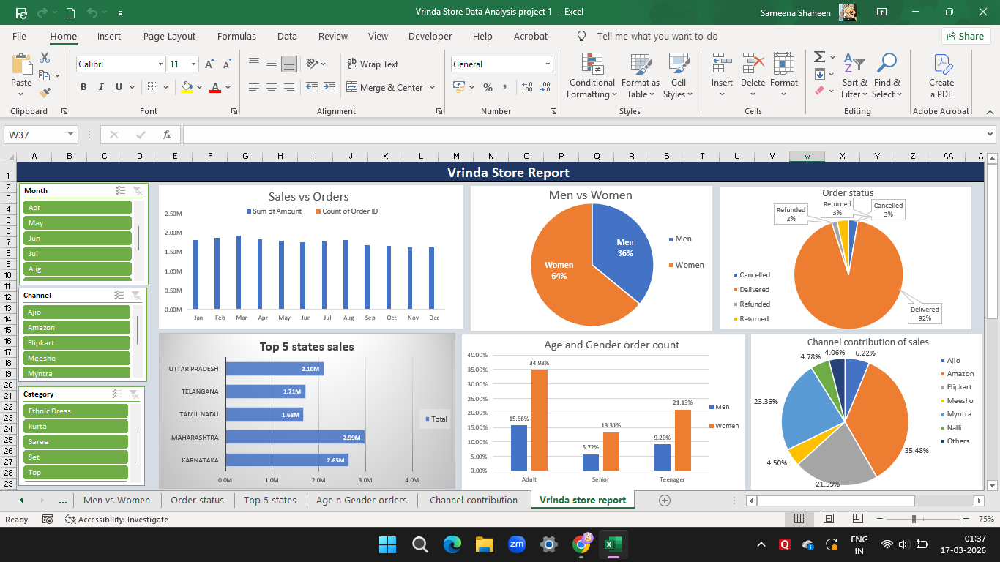

# Vrinda Store Sales Data Analysis (Excel Dashboard)

## Project Overview
This project analyzes sales data of Vrinda Store using Microsoft Excel.  
Using pivot tables, charts, and dashboards, I explored customer behavior and sales trends.

## Tools Used
- Microsoft Excel
- Pivot Tables
- Pivot Charts
- Dashboard Design

## Dashboard

## Key Insights
- Women contribute around **64% of purchases**
- Top states: **Maharashtra, Karnataka, Uttar Pradesh**
- Adults aged **30–49** generate the highest orders
- Amazon, Flipkart and Myntra generate the most sales

## Business Recommendation
Target **women aged 30–49 in top-performing states** with promotions on Amazon, Flipkart and Myntra.
